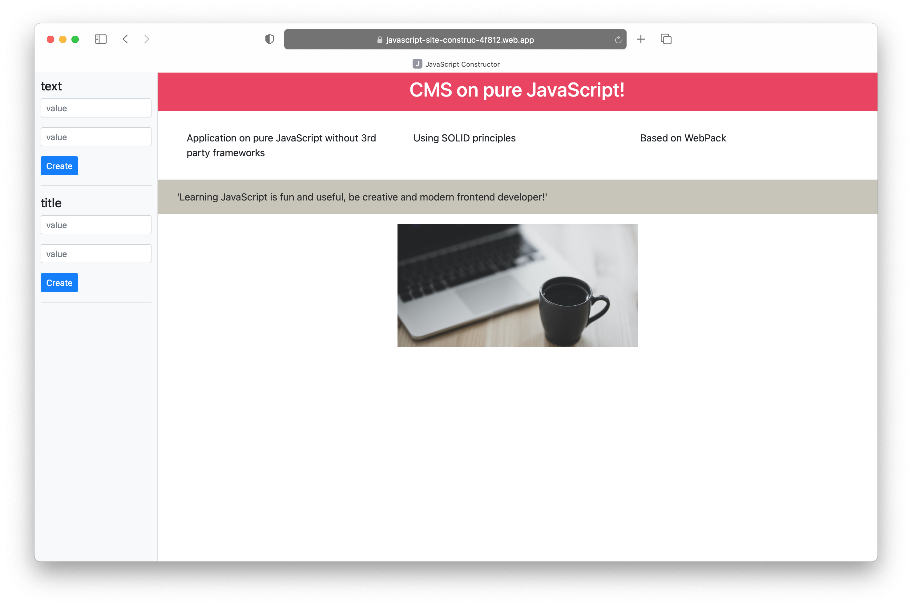
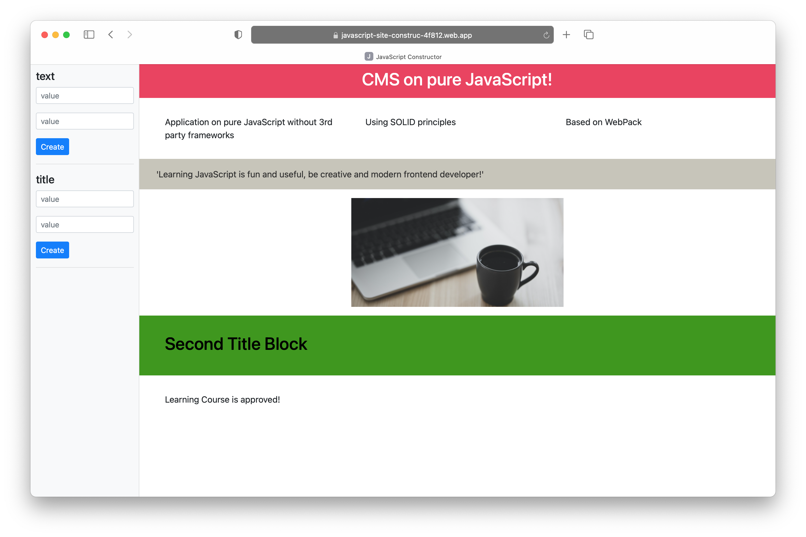

# Site constructor on pure JavaScript

En example of implementation a creating of web-site using only vanilla JavaScript and CSS.

Based on [Vladilen Minin's JavaScript Learning Course](https://vladilen.ru/) "Creating website constructor on pure JavaScript.

Project goals:
+ Pure JavaScript (without 3rd party web apps frameworks/libraries)
+ WebPack module bundler
+ Using SOLID principles and OOP
+ Bootstrap CSS framework
+ Firebase hosting 

#### Demo:
The project was published on Firebase Hosting https://javascript-site-construc-4f812.web.app/

#### Screenshots:

